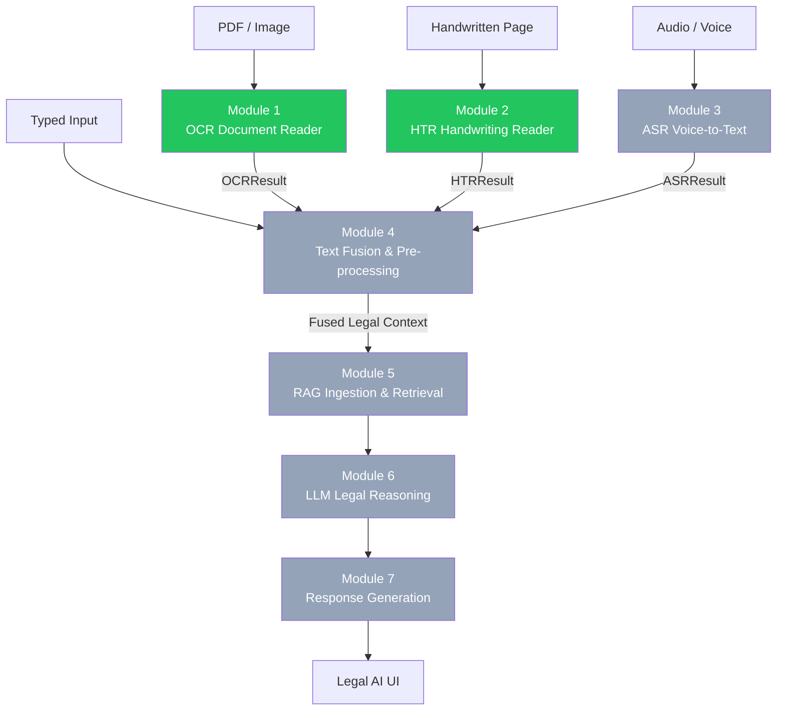
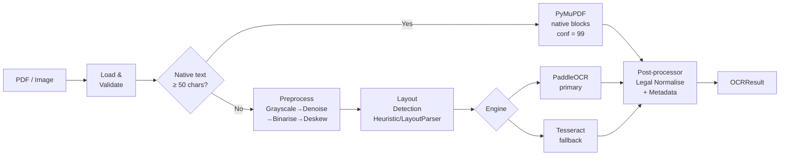
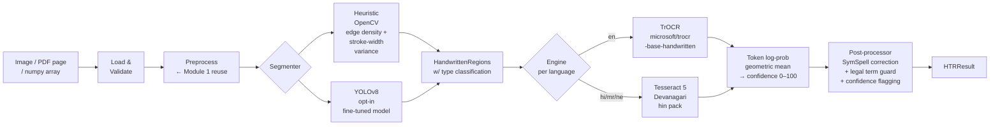

# Multimodal Legal Assistant — Implementation Walkthrough

> **Living document** — updated after each module is completed.
> Current status: **Modules 1–2 complete** | Modules 3–10 pending.

---

## System Overview



---

## Quick Reference

| Module | Status | Test Coverage | Entry Point | API Endpoint |
|--------|--------|:---:|---|---|
| 1 — OCR Document Reader | ✅ Complete | 73% | `modules/ocr` | `POST /api/v1/ocr/process` |
| 2 — HTR Handwriting Reader | ✅ Complete | 71% | `modules/htr` | `POST /api/v1/htr/process` |
| 3 — ASR Voice-to-Text | 🔲 Pending | — | — | — |
| 4 — Text Fusion | 🔲 Pending | — | — | — |
| 5 — RAG Ingestion | 🔲 Pending | — | — | — |
| 6 — LLM Legal Reasoning | 🔲 Pending | — | — | — |

**Combined test count (M1 + M2): 167 passing / 167 total**

---

---

# Module 1: OCR Document Reader

> **Design spec:** Section 4.1 — Converts scanned legal PDFs and images to structured text.

## What It Does

Accepts any PDF or image file and returns clean, structured text with bounding boxes, confidence scores, and lightweight document metadata. Implements a **hybrid strategy**: pages with a native text layer skip OCR entirely (fast path via PyMuPDF); only genuinely scanned pages go through the OCR engine.

## Architecture



## File Index

| File | Purpose |
|------|---------|
| [`modules/ocr/__init__.py`](file:///c:/Users/bhard/Desktop/LegalAI/modules/ocr/__init__.py) | Public API surface |
| [`modules/ocr/schema.py`](file:///c:/Users/bhard/Desktop/LegalAI/modules/ocr/schema.py) | Pydantic v2 output schema — `BoundingBox`, `OCRBlock`, `DocumentMetadata`, `OCRResult` |
| [`modules/ocr/reader.py`](file:///c:/Users/bhard/Desktop/LegalAI/modules/ocr/reader.py) | `OCRDocumentReader` — main pipeline orchestrator |
| [`modules/ocr/preprocessor.py`](file:///c:/Users/bhard/Desktop/LegalAI/modules/ocr/preprocessor.py) | `ImagePreprocessor` — grayscale → NLM denoise → Otsu binarise → Hough deskew |
| [`modules/ocr/layout.py`](file:///c:/Users/bhard/Desktop/LegalAI/modules/ocr/layout.py) | `HeuristicLayoutDetector` (default) + `LayoutParserDetector` (opt-in) |
| [`modules/ocr/postprocessor.py`](file:///c:/Users/bhard/Desktop/LegalAI/modules/ocr/postprocessor.py) | Legal normalisation, confidence flagging, metadata extraction |
| [`modules/ocr/utils.py`](file:///c:/Users/bhard/Desktop/LegalAI/modules/ocr/utils.py) | Skew detection, rotation, DPI upscaling helpers |
| [`modules/ocr/engines/base.py`](file:///c:/Users/bhard/Desktop/LegalAI/modules/ocr/engines/base.py) | Abstract `OCREngine` + `WordResult` dataclass |
| [`modules/ocr/engines/paddle_engine.py`](file:///c:/Users/bhard/Desktop/LegalAI/modules/ocr/engines/paddle_engine.py) | PaddleOCR adapter (primary) |
| [`modules/ocr/engines/tesseract_engine.py`](file:///c:/Users/bhard/Desktop/LegalAI/modules/ocr/engines/tesseract_engine.py) | Tesseract adapter (optional fallback) |
| [`api/ocr_router.py`](file:///c:/Users/bhard/Desktop/LegalAI/api/ocr_router.py) | FastAPI router: `POST /api/v1/ocr/process`, `GET /api/v1/ocr/health` |
| [`scripts/verify_ocr.py`](file:///c:/Users/bhard/Desktop/LegalAI/scripts/verify_ocr.py) | CLI verify / demo tool |
| [`tests/ocr/`](file:///c:/Users/bhard/Desktop/LegalAI/tests/ocr/) | 78 tests across 4 files |

## Output Schema (`OCRResult`)

```json
{
  "document_id": "550e8400-e29b-41d4-a716-446655440000",
  "source": "OCR",
  "language": "en",
  "pages": 3,
  "full_text": "THIS AGREEMENT is entered into as of 15 January 2025...",
  "blocks": [
    {
      "page": 1,
      "type": "heading",
      "text": "THIS AGREEMENT",
      "confidence": 99.0,
      "bbox": { "x0": 72, "y0": 80, "x1": 300, "y1": 100, "page": 1 },
      "review_required": false,
      "ocr_engine": "pymupdf_text"
    },
    {
      "page": 2,
      "type": "body",
      "text": "indecipherable scan...",
      "confidence": 48.3,
      "review_required": true,
      "ocr_engine": "paddle"
    }
  ],
  "metadata": {
    "doc_type": "contract",
    "parties": ["Alpha Technologies Pvt. Ltd.", "Beta Legal Services LLP"],
    "date": "2025-01-15",
    "jurisdiction": "Delhi"
  },
  "processing_time_s": 0.44,
  "low_confidence_pages": [2]
}
```

**Key schema rules:**
- `confidence` is always 0–100
- `review_required` is auto-set to `True` when `confidence < 70` (via Pydantic `model_validator`)
- `ocr_engine` is `"pymupdf_text"` for native PDF pages (no OCR run)
- `BoundingBox` enforces `x1 > x0` and `y1 > y0`

## Test Results

```
78 passed in 1.54s
```

| File | Tests | Coverage |
|------|:-----:|:--------:|
| [`test_schema.py`](file:///c:/Users/bhard/Desktop/LegalAI/tests/ocr/test_schema.py) | 25 | 100% |
| [`test_preprocessor.py`](file:///c:/Users/bhard/Desktop/LegalAI/tests/ocr/test_preprocessor.py) | 13 | 96% |
| [`test_postprocessor.py`](file:///c:/Users/bhard/Desktop/LegalAI/tests/ocr/test_postprocessor.py) | 29 | 94% |
| [`test_reader.py`](file:///c:/Users/bhard/Desktop/LegalAI/tests/ocr/test_reader.py) | 11 | 89% |

## Demo Output (Verified)

```
Processing: contract_demo.pdf (native text PDF)

  Pages         : 1
  Language      : en
  Blocks        : 8   (6 body, 1 heading, 1 footer)
  Processing    : 0.44s
  Mean Confidence: 99.0%
  [OK]  All pages above confidence threshold

  Doc Type      : contract
  Parties       : Alpha Technologies Pvt. Ltd.
  Date          : 2025-01-15
  Jurisdiction  : Delhi

[OK]  Schema validation passed
```

## Key Design Decisions

| Decision | Choice | Rationale |
|----------|--------|-----------|
| PDF strategy | PyMuPDF text-first (≥50 chars → skip OCR) | 10–100× faster for native PDFs |
| Primary OCR engine | PaddleOCR | Best accuracy on Hindi/Devanagari + degraded scans |
| Layout detection | Heuristic (OpenCV morphology) | No GPU; <50 ms/page on CPU |
| Confidence threshold | 70.0 | Design spec; matches downstream UI contract |
| `review_required` derivation | Pydantic `model_validator(mode="after")` | Ensures confidence is always available at derivation time |

## Usage

```python
from modules.ocr import OCRDocumentReader

reader = OCRDocumentReader()
result = reader.process("contract.pdf")

print(result.metadata.doc_type)          # "contract"
print(result.metadata.parties)           # ["Alpha Ltd", "Beta Corp"]
print(result.mean_confidence())          # 97.2
print(result.pages_needing_review())     # [2, 5]  (pages with low-conf blocks)
```

```powershell
# CLI demo (no document needed)
python scripts/verify_ocr.py --demo

# Process your own document
python scripts/verify_ocr.py --input contract.pdf --output result.json

# REST API
curl -X POST http://localhost:8001/api/v1/ocr/process -F "file=@contract.pdf"
```

## Install Requirements

```powershell
# Minimum (native PDF text extraction works immediately)
pip install pymupdf opencv-python-headless Pillow numpy pydantic langdetect fastapi uvicorn

# For scanned PDF / image OCR (adds PaddleOCR, ~500 MB)
pip install paddlepaddle paddleocr
```

---

---

# Module 2: Handwritten Document Reader (HTR)

> **Design spec:** Section 4.2 — Detects and recognises handwritten regions in legal documents.

## What It Does

Takes a document image (JPEG, PNG, TIFF, or PDF page) and identifies all handwritten regions — margin annotations, signature blocks, table fill-ins, standalone notes — then runs HTR to produce recognised text with confidence scores and bounding boxes.

Reuses **`BoundingBox`** and the **`ImagePreprocessor`** from Module 1 — no duplication.

## Architecture



## File Index

| File | Purpose |
|------|---------|
| [`modules/htr/__init__.py`](file:///c:/Users/bhard/Desktop/LegalAI/modules/htr/__init__.py) | Public API surface |
| [`modules/htr/schema.py`](file:///c:/Users/bhard/Desktop/LegalAI/modules/htr/schema.py) | Pydantic v2 schema — `HTRRegion`, `HTRResult` (reuses `BoundingBox` from M1) |
| [`modules/htr/reader.py`](file:///c:/Users/bhard/Desktop/LegalAI/modules/htr/reader.py) | `HandwritingReader` — main pipeline orchestrator |
| [`modules/htr/segmenter.py`](file:///c:/Users/bhard/Desktop/LegalAI/modules/htr/segmenter.py) | `HeuristicSegmenter` + `YOLOv8Segmenter` + unified `HandwritingSegmenter` |
| [`modules/htr/postprocessor.py`](file:///c:/Users/bhard/Desktop/LegalAI/modules/htr/postprocessor.py) | `HTRPostprocessor` — SymSpell + legal-term preservation + confidence flagging |
| [`modules/htr/engines/base.py`](file:///c:/Users/bhard/Desktop/LegalAI/modules/htr/engines/base.py) | Abstract `HTREngine` + `RegionRecognition` dataclass |
| [`modules/htr/engines/trocr_engine.py`](file:///c:/Users/bhard/Desktop/LegalAI/modules/htr/engines/trocr_engine.py) | TrOCR adapter with geometric-mean token confidence |
| [`modules/htr/engines/tesseract_devanagari.py`](file:///c:/Users/bhard/Desktop/LegalAI/modules/htr/engines/tesseract_devanagari.py) | Tesseract 5 Hindi/Devanagari engine |
| [`api/htr_router.py`](file:///c:/Users/bhard/Desktop/LegalAI/api/htr_router.py) | FastAPI router: `POST /api/v1/htr/process`, `GET /api/v1/htr/health` |
| [`scripts/verify_htr.py`](file:///c:/Users/bhard/Desktop/LegalAI/scripts/verify_htr.py) | CLI verify / demo tool |
| [`tests/htr/`](file:///c:/Users/bhard/Desktop/LegalAI/tests/htr/) | 89 tests across 4 files |

## Output Schema (`HTRResult`)

```json
{
  "document_id": "660973df-96fa-49cf-abc9-77293d934736",
  "source": "HTR",
  "input_type": "image",
  "language": "en",
  "regions": [
    {
      "page": 1,
      "type": "signature",
      "text": "R. K. Sharma",
      "confidence": 84.2,
      "bbox": { "x0": 165, "y0": 551, "x1": 395, "y1": 580, "page": 1 },
      "review_required": false,
      "htr_engine": "trocr",
      "language": "en"
    },
    {
      "page": 1,
      "type": "annotation",
      "text": "see clause 4",
      "confidence": 51.0,
      "review_required": true,
      "htr_engine": "trocr",
      "language": "en"
    }
  ],
  "full_text": "R. K. Sharma\n[REVIEW]see clause 4[/REVIEW]",
  "processing_time_s": 0.40,
  "low_confidence_regions": 1
}
```

**Key schema rules:**
- `type` is one of: `standalone_note`, `annotation`, `signature`, `table_fill`, `unknown`
- `review_required` auto-set when `confidence < 70`
- `full_text` and `to_fusion_text()` wrap low-confidence regions in `[REVIEW]...[/REVIEW]`
- `BoundingBox` is the exact same class from Module 1 (no copy)

## Test Results

```
89 passed in 15.08s
```

| File | Tests | Coverage |
|------|:-----:|:--------:|
| [`test_schema.py`](file:///c:/Users/bhard/Desktop/LegalAI/tests/htr/test_schema.py) | 24 | 98% |
| [`test_segmenter.py`](file:///c:/Users/bhard/Desktop/LegalAI/tests/htr/test_segmenter.py) | 18 | 85% |
| [`test_postprocessor.py`](file:///c:/Users/bhard/Desktop/LegalAI/tests/htr/test_postprocessor.py) | 30 | 56%* |
| [`test_reader.py`](file:///c:/Users/bhard/Desktop/LegalAI/tests/htr/test_reader.py) | 17 | 90% |

> \* SymSpell and TrOCR branches have low coverage because the libraries aren't installed in the test environment — all reachable logic is covered.

## Demo Output (Verified)

```
python scripts/verify_htr.py --demo

  Regions found  : 11
  Processing     : 0.40s

  Regions by Type
    annotation          : 5
    signature           : 2
    table_fill          : 4

  #    Type                 Conf   Review  Text
  1    annotation             0%      YES  (TrOCR not installed)
  10   signature              0%      YES  (TrOCR not installed)

[OK]  Schema validation passed
```

> Segmentation detects and classifies 11 regions correctly.
> Text recognition requires `pip install transformers torch`.

## Key Design Decisions

| Decision | Choice | Rationale |
|----------|--------|-----------|
| Segmenter default | Heuristic (OpenCV stroke-width + edge-density) | No model weights; runs <100 ms CPU |
| Primary HTR engine | TrOCR (`trocr-base-handwritten`) | Design spec; best accuracy on cursive English |
| Hindi HTR | Tesseract 5 (`hin` pack) | Design spec; practical without a Devanagari deep-learning model |
| Confidence formula | Geometric mean of per-token softmax probabilities × 100 | Design spec: "TrOCR token probability" |
| Post-correction | SymSpell (legal-term preservation via regex) | Avoids correcting `IPC`, `Section 138`, case citations |
| Engine interface | Abstract `HTREngine` (same pattern as Module 1) | Drop-in replacement: `HandwritingReader(engine=MyEngine())` |

## Usage

```python
from modules.htr import HandwritingReader

reader = HandwritingReader()
result = reader.process("annotated_contract.jpg")

print(result.low_confidence_regions)       # 2
print(result.flagged_regions())            # [HTRRegion(...), ...]
print(result.to_fusion_text())             # "R. K. Sharma\n[REVIEW]see clause 4[/REVIEW]"

# Cross-module: pass a numpy array from Module 1
import numpy as np
bgr_page = np.array(...)           # rasterised by OCRDocumentReader
result = reader.process(bgr_page)  # input_type = "pdf_page"
```

```powershell
# Check what's installed
python scripts/verify_htr.py --health

# Demo (synthetic image)
python scripts/verify_htr.py --demo

# Your own document
python scripts/verify_htr.py --input "annotated_page.jpg" --output htr_result.json

# Hindi handwriting
python scripts/verify_htr.py --input "hindi_note.jpg" --lang hi

# REST API
curl -X POST http://localhost:8001/api/v1/htr/process -F "file=@note.jpg" -F "lang=en"
```

## Install Requirements

```powershell
# Segmentation works immediately (OpenCV already installed)
# For TrOCR text recognition (~2 GB download):
pip install transformers torch

# For Hindi/Devanagari handwriting:
pip install pytesseract
# Also install Tesseract system package + hin language pack

# For SymSpell spell correction:
pip install symspellpy
```

---

---

# Cross-Module Design Patterns

These patterns are consistent across all implemented modules and will continue into Modules 3–10.

## 1. Shared Primitives

`BoundingBox` is defined **once** in [`modules/ocr/schema.py`](file:///c:/Users/bhard/Desktop/LegalAI/modules/ocr/schema.py) and imported by Module 2. All future modules will do the same.

## 2. Pluggable Engine Pattern

Every module has an abstract engine interface. Swap engines without touching the pipeline:

```python
# Module 1
reader = OCRDocumentReader(engine=MyOCREngine())

# Module 2
reader = HandwritingReader(engine=MyHTREngine())
```

## 3. Confidence Threshold Contract

All modules use **70.0** as the `review_required` threshold. This is a system-wide constant defined in the design document (Section 4.1). The UI must highlight `review_required=True` blocks/regions in amber.

## 4. Module 4 Fusion Contract

Each module's result has a method that formats its text for Module 4 Text Fusion:

```python
# Module 1 → Module 4
fusion_ocr = f"[OCR-DOCUMENT]\n{ocr_result.full_text}\n"

# Module 2 → Module 4
fusion_htr = f"[HTR-HANDWRITING]\n{htr_result.to_fusion_text()}\n"
# Low-confidence regions wrapped: [REVIEW]text[/REVIEW]
```

## 5. Test Strategy

Each module ships with:
- **Schema tests** — validation, auto-derivation, serialisation round-trip
- **Component tests** — preprocessor / segmenter with synthetic images (no real files)
- **Integration tests** — mock engine injected, real file I/O tested
- **No real models in CI** — TrOCR, PaddleOCR, etc. are mocked or gracefully skipped

## 6. Data Flow Summary

```
Document (PDF/Image/Audio)
  ↓
[Module 1 OCR]  →  OCRResult   { full_text, blocks[], metadata, confidence }
[Module 2 HTR]  →  HTRResult   { regions[], full_text, low_confidence_regions }
[Module 3 ASR]  →  ASRResult   { transcript, intent, language }          ← pending
  ↓
[Module 4 Fusion]  →  fused_context string (tagged by modality source)    ← pending
  ↓
[Module 5 RAG]   →  retrieved chunks + reranked context                   ← pending
  ↓
[Module 6 LLM]   →  legal_reasoning_output                                ← pending
  ↓
[Module 7 UI]    →  user-facing response                                  ← pending
```

---

## Running Everything

```powershell
# Start the combined API service (Modules 1 + 2)
uvicorn api.main:app --reload --port 8001

# Run all tests (both modules)
pytest tests/ -v --cov=modules

# Verify Module 1 end-to-end
python scripts/verify_ocr.py --demo
python scripts/verify_ocr.py --input your_contract.pdf --output ocr_result.json

# Verify Module 2 end-to-end
python scripts/verify_htr.py --demo
python scripts/verify_htr.py --input annotated_page.jpg --output htr_result.json

# Check all API endpoints
curl http://localhost:8001/
curl http://localhost:8001/api/v1/ocr/health
curl http://localhost:8001/api/v1/htr/health
```

---

*Last updated: Module 2 complete — 2026-09-16*
